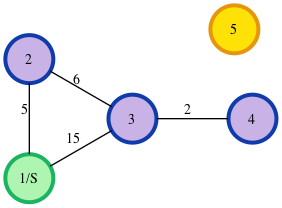

# [Dijkstra: Shortest Reach 2](https://www.hackerrank.com/challenges/dijkstrashortreach/problem)

## Problem

### Description

Given an undirected graph and a starting node, determine the lengths of the
shortest paths from the starting node to all other nodes in the graph. If a node
is unreachable, its distance is `-1`. Nodes will be numbered consecutively
from `1` to `n`, and edges will have varying distances or lengths.

For example, consider the following graph of 5 nodes:

```text
Begin   End     Weight
1       2       5
2       3       6
3       4       2
1       3       15
```



The distances to all nodes in increasing node order, omitting the starting node,
are `5 11 13 -1`.

### Function description

Complete the `shortestReach()` function. It should return an array of integers
that represent the shortest distance to each node from the start node in
ascending order of node number.

`shortestReach` has the following parameter(s):

* `n`: the number of nodes in the graph
* `edges`: a 2D array of integers where each `edges[i]` consists of three
  integers that represent the start and end nodes of an edge, followed by its
  length
* `s`: the start node number

### Input format

The first line contains `t`, the number of test cases.

Each test case is as follows:

* The first line contains two space-separated integers `n` and `m` , the number
  of nodes and edges in the graph.
* Each of the next `m` lines contains three space-separated integers `x`, `y`,
  and `r`, the beginning and ending nodes of an edge, and the length of the
  edge.
* The last line of each test case has an integer `s`, denoting the starting
  position.

### Output Format

For each of the `t`test cases, print a single line consisting `n - 1` space
separated integers denoting the shortest distance to the `n - 1`nodes from
starting position `s` in increasing order of their labels, excluding `s`.

For unreachable nodes, print `-1`.

### Constraints

* `1 <= t <= 10`
* `2 <= n <= 3000`
* `1 <= m <= n * (n-1) / 2`
* `1 <= x,y,s, <= N`
* `1 <= r <= 10^5`

If there are edges between the same pair of nodes with different weights, they
are to be considered as is, like multiple edges.

### Sample inputs

#### Example 1

```text
1
4 4
1 2 24
1 4 20
3 1 3
4 3 12
1
```

```text
24 3 15
```

#### Example 2

```text
1
5 3
1 2 10
1 3 6
2 4 8
2
```

```text
10 16 8 -1
```

## Solutions

### Common code provided by the platform

```go
package main

import (
	"bufio"
	"fmt"
	"io"
	"os"
	"strconv"
	"strings"
)

func main() {
	reader := bufio.NewReaderSize(os.Stdin, 16*1024*1024)

	stdout, err := os.Create(os.Getenv("OUTPUT_PATH"))
	checkError(err)

	defer stdout.Close()

	writer := bufio.NewWriterSize(stdout, 16*1024*1024)

	tTemp, err := strconv.ParseInt(strings.TrimSpace(readLine(reader)), 10, 64)
	checkError(err)
	t := int32(tTemp)

	for tItr := 0; tItr < int(t); tItr++ {
		firstMultipleInput := strings.Split(strings.TrimSpace(readLine(reader)), " ")

		nTemp, err := strconv.ParseInt(firstMultipleInput[0], 10, 64)
		checkError(err)
		n := int32(nTemp)

		mTemp, err := strconv.ParseInt(firstMultipleInput[1], 10, 64)
		checkError(err)
		m := int32(mTemp)

		var edges [][]int32
		for i := 0; i < int(m); i++ {
			edgesRowTemp := strings.Split(strings.TrimRight(readLine(reader), " \t\r\n"), " ")

			var edgesRow []int32
			for _, edgesRowItem := range edgesRowTemp {
				edgesItemTemp, err := strconv.ParseInt(edgesRowItem, 10, 64)
				checkError(err)
				edgesItem := int32(edgesItemTemp)
				edgesRow = append(edgesRow, edgesItem)
			}

			if len(edgesRow) != 3 {
				panic("Bad input")
			}

			edges = append(edges, edgesRow)
		}

		sTemp, err := strconv.ParseInt(strings.TrimSpace(readLine(reader)), 10, 64)
		checkError(err)
		s := int32(sTemp)

		result := shortestReach(n, edges, s)

		for i, resultItem := range result {
			fmt.Fprintf(writer, "%d", resultItem)

			if i != len(result)-1 {
				fmt.Fprintf(writer, " ")
			}
		}

		fmt.Fprintf(writer, "\n")
	}

	writer.Flush()
}

func readLine(reader *bufio.Reader) string {
	str, _, err := reader.ReadLine()
	if err == io.EOF {
		return ""
	}

	return strings.TrimRight(string(str), "\r\n")
}

func checkError(err error) {
	if err != nil {
		panic(err)
	}
}
```

Then just implement:

```go
func shortestReach(n int32, edges [][]int32, s int32) []int32 {}
```

### BFS

This solution times out on a test case with a lot of parallel edges

```go
package main

/*
 * Complete the 'shortestReach' function below.
 *
 * The function is expected to return an INTEGER_ARRAY.
 * The function accepts following parameters:
 *  1. INTEGER n
 *  2. 2D_INTEGER_ARRAY edges
 *  3. INTEGER s
 */

type pair struct {
	node   int32
	weight int32
}

func shortestReach(n int32, edges [][]int32, s int32) []int32 {
	graph := make([][]pair, n)
	for i := int32(0); i < n; i++ {
		graph[i] = make([]pair, 0)
	}

	for _, edge := range edges {
		graph[edge[0]-1] = append(graph[edge[0]-1], pair{
			node:   edge[1] - 1,
			weight: edge[2],
		})

		graph[edge[1]-1] = append(graph[edge[1]-1], pair{
			node:   edge[0] - 1,
			weight: edge[2],
		})
	}

	distances := make([]int32, n)
	for i := 0; i < len(distances); i += 1 {
		distances[i] = -1
	}

	queue := make([]pair, 0)
	next := make([]pair, 0)

	queue = append(queue, pair{
		node:   s - 1,
		weight: 0,
	})

	for len(queue) > 0 {
		for i := 0; i < len(queue); i++ {
			entry := queue[i]
			if distances[entry.node] != -1 && distances[entry.node] <= entry.weight {
				continue
			}

			distances[entry.node] = entry.weight

			for _, link := range graph[entry.node] {
				weight := link.weight + entry.weight
				if distances[link.node] != -1 && distances[link.node] <= weight {
					continue
				}

				next = append(next, pair{
					node:   link.node,
					weight: weight,
				})
			}
		}

		queue, next = next, queue[0:0]

	}

	answer := make([]int32, n-1)
	// Note that `s` is 1-based index, so we subtract `1` to make it 0-based
	copy(answer[0:s-1], distances[0:s-1])
	copy(answer[s-1:], distances[s:])

	return answer
}
```

### Dijkstra

This solution times out on a test case with a lot of parallel edges

```go
package main

/*
 * Complete the 'shortestReach' function below.
 *
 * The function is expected to return an INTEGER_ARRAY.
 * The function accepts following parameters:
 *  1. INTEGER n
 *  2. 2D_INTEGER_ARRAY edges
 *  3. INTEGER s
 */

type pair struct {
	node   int32
	weight int32
}

// Behold the horrors of using a PQ in Go.

type PriorityQueue []pair

func (pq PriorityQueue) Len() int {
	return len(pq)
}

func (pq PriorityQueue) Less(i, j int) bool {
	return pq[i].weight < pq[j].weight
}

func (pq PriorityQueue) Swap(i, j int) {
	pq[i], pq[j] = pq[j], pq[i]
}

func (pq *PriorityQueue) Push(x interface{}) {
	*pq = append(*pq, x.(pair))
}

func (pq *PriorityQueue) Pop() interface{} {
	old := *pq
	n := len(old)
	item := old[n-1]
	*pq = old[0 : n-1]
	return item
}

func shortestReach(n int32, edges [][]int32, s int32) []int32 {
	graph := make([][]pair, n)
	for i := int32(0); i < n; i++ {
		graph[i] = make([]pair, 0)
	}

	for _, edge := range edges {
		// subtract `-1 from the node indexes because they are 1-based, but we need them to be 0-based
		graph[edge[0]-1] = append(graph[edge[0]-1], pair{
			node:   edge[1] - 1,
			weight: edge[2],
		})

		// subtract `-1 from the node indexes because they are 1-based, but we need them to be 0-based
		graph[edge[1]-1] = append(graph[edge[1]-1], pair{
			node:   edge[0] - 1,
			weight: edge[2],
		})
	}

	distances := make([]int32, n)
	for i := 0; i < len(distances); i += 1 {
		distances[i] = -1
	}

	queue := make(PriorityQueue, 0)
	queue.Push(pair{
		// subtract `-1 from the node indexes because they are 1-based, but we need them to be 0-based
		node:   s - 1,
		weight: 0,
	})

	for len(queue) > 0 {
		entry := queue.Pop().(pair)
		if distances[entry.node] != -1 && distances[entry.node] <= entry.weight {
			continue
		}

		distances[entry.node] = entry.weight

		for _, link := range graph[entry.node] {
			weight := link.weight + entry.weight
			if distances[link.node] != -1 && distances[link.node] <= weight {
				continue
			}

			queue.Push(pair{
				node:   link.node,
				weight: weight,
			})
		}
	}

	answer := make([]int32, n-1)
	// Note that `s` is 1-based index, so we subtract `1` to make it 0-based
	copy(answer[0:s-1], distances[0:s-1])
	copy(answer[s-1:], distances[s:])

	return answer
}
```

### Dijkstra #2

This solution passes the test case with a lot of parallel edges, but fails 2 on
other tests.I guess the reason is that iteration over a go map is very slow
compared to iteration over a slice, so if there are a lot of unique edges, it
will time out

```go
package main

/*
 * Complete the 'shortestReach' function below.
 *
 * The function is expected to return an INTEGER_ARRAY.
 * The function accepts following parameters:
 *  1. INTEGER n
 *  2. 2D_INTEGER_ARRAY edges
 *  3. INTEGER s
 */

type pair struct {
	node   int32
	weight int32
}

type PriorityQueue []pair

func (pq PriorityQueue) Len() int {
	return len(pq)
}

func (pq PriorityQueue) Less(i, j int) bool {
	return pq[i].weight < pq[j].weight
}

func (pq PriorityQueue) Swap(i, j int) {
	pq[i], pq[j] = pq[j], pq[i]
}

func (pq *PriorityQueue) Push(x interface{}) {
	*pq = append(*pq, x.(pair))
}

func (pq *PriorityQueue) Pop() interface{} {
	old := *pq
	n := len(old)
	item := old[n-1]
	*pq = old[0 : n-1]
	return item
}

func shortestReach(n int32, edges [][]int32, s int32) []int32 {
	// use a map,instead of a slice in order to remove parallel edges
	// because the ones with higher weights won't be used anyway, but will
	// increase the computation effort
	graph := make([]map[int32]int32, n)
	for i := int32(0); i < n; i++ {
		graph[i] = make(map[int32]int32)
	}

	for _, edge := range edges {
		weight, ok := graph[edge[0]-1][edge[1]-1]
		if !ok || weight > edge[2] {
			graph[edge[0]-1][edge[1]-1] = edge[2]
		}

		weight, ok = graph[edge[1]-1][edge[0]-1]
		if !ok || weight > edge[2] {
			graph[edge[1]-1][edge[0]-1] = edge[2]
		}
	}

	distances := make([]int32, n)
	for i := 0; i < len(distances); i += 1 {
		distances[i] = -1
	}

	queue := make(PriorityQueue, 0)
	queue.Push(pair{
		node:   s - 1,
		weight: 0,
	})

	for len(queue) > 0 {
		entry := queue.Pop().(pair)
		if distances[entry.node] != -1 && distances[entry.node] <= entry.weight {
			continue
		}

		distances[entry.node] = entry.weight

		for node, weight := range graph[entry.node] {
			w := weight + entry.weight
			if distances[node] != -1 && distances[node] <= w {
				continue
			}

			queue.Push(pair{
				node:   node,
				weight: w,
			})
		}
	}

	answer := make([]int32, n-1)
	// Note that `s` is 1-based index, so we subtract `1` to make it 0-based
	copy(answer[0:s-1], distances[0:s-1])
	copy(answer[s-1:], distances[s:])

	return answer
}
```

### Dijkstra #3 (success!)

This solution passes all tests by doing the following:

* remove parallel edges, by preserving only the ones with the smallest weight
  value
* use a slices in the dijkstra loop, instead of the maps. It seems that it's
  very slow to iterate over a go map (go 1.18)

```go
package main

type pair struct {
	node   int32
	weight int32
}

type PriorityQueue []pair

func (pq PriorityQueue) Len() int {
	return len(pq)
}

func (pq PriorityQueue) Less(i, j int) bool {
	return pq[i].weight < pq[j].weight
}

func (pq PriorityQueue) Swap(i, j int) {
	pq[i], pq[j] = pq[j], pq[i]
}

func (pq *PriorityQueue) Push(x interface{}) {
	*pq = append(*pq, x.(pair))
}

func (pq *PriorityQueue) Pop() interface{} {
	old := *pq
	n := len(old)
	item := old[n-1]
	*pq = old[0 : n-1]
	return item
}
func shortestReach(n int32, edges [][]int32, s int32) []int32 {
	// use a map,instead of a slice in order to remove parallel edges
	// because the ones with higher weights won't be used anyway, but will
	// increase the computation effort
	g := make([]map[int32]int32, n)
	for i := int32(0); i < n; i++ {
		g[i] = make(map[int32]int32)
	}

	for _, edge := range edges {
		weight, ok := g[edge[0]-1][edge[1]-1]
		if !ok || weight > edge[2] {
			g[edge[0]-1][edge[1]-1] = edge[2]
		}

		weight, ok = g[edge[1]-1][edge[0]-1]
		if !ok || weight > edge[2] {
			g[edge[1]-1][edge[0]-1] = edge[2]
		}
	}

	// it's slow to iterate over the maps, so rebuild the graph using slices
	// We still iterate over the maps, but only once
	graph := make([][]pair, n)
	for i := int32(0); i < n; i++ {
		graph[i] = make([]pair, 0)
	}

	for fromNode, nodeEdges := range g {
		for toNode, weight := range nodeEdges {
			graph[fromNode] = append(graph[fromNode], pair{
				node:   toNode,
				weight: weight,
			})
		}
	}

	distances := make([]int32, n)
	for i := 0; i < len(distances); i += 1 {
		distances[i] = -1
	}

	queue := make(PriorityQueue, 0)
	queue.Push(pair{
		// subtract `-1 from the node indexes because they are 1-based, but we need them to be 0-based
		node:   s - 1,
		weight: 0,
	})

	for len(queue) > 0 {
		entry := queue.Pop().(pair)
		if distances[entry.node] != -1 && distances[entry.node] <= entry.weight {
			continue
		}

		distances[entry.node] = entry.weight

		for _, link := range graph[entry.node] {
			weight := link.weight + entry.weight
			if distances[link.node] != -1 && distances[link.node] <= weight {
				continue
			}

			queue.Push(pair{
				node:   link.node,
				weight: weight,
			})
		}
	}

	answer := make([]int32, n-1)
	// Note that `s` is 1-based index, so we subtract `1` to make it 0-based
	copy(answer[0:s-1], distances[0:s-1])
	copy(answer[s-1:], distances[s:])

	return answer
}
```