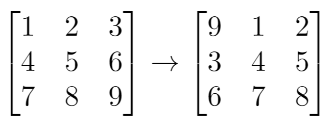

# [1260. Shift 2D Grid](https://leetcode.com/problems/shift-2d-grid/)

## Problem

### Description

Given a 2D grid of size `m x n` and an integer `k`. You need to shift the
grid `k` times.

In one shift operation:

* Element at `grid[i][j]` moves to `grid[i][j + 1]`.
* Element at `grid[i][n - 1]` moves to `grid[i + 1][0]`.
* Element at `grid[m - 1][n - 1]` moves to `grid[0][0]`.

Return the 2D grid after applying shift operation `k` times.

### Constraints

* `m == grid.length`
* `n == grid[i].length`
* `1 <= m <= 50`
* `1 <= n <= 50`
* `-1000 <= grid[i][j] <= 1000`
* `0 <= k <= 100`

### Examples

#### Example 1



```text
Input: grid = [[1,2,3],[4,5,6],[7,8,9]], k = 1
Output: [[9,1,2],[3,4,5],[6,7,8]]
```

#### Example 2


```text
Input: grid = [[3,8,1,9],[19,7,2,5],[4,6,11,10],[12,0,21,13]], k = 4
Output: [[12,0,21,13],[3,8,1,9],[19,7,2,5],[4,6,11,10]]
```

#### Example 3

```text
Input: grid = [[1,2,3],[4,5,6],[7,8,9]], k = 9
Output: [[1,2,3],[4,5,6],[7,8,9]]
```

## Solutions

#### Observations

The "shift" steps describe how to "rotate" a 1-D array by 1 element to the right
by using its 2-d representation. Take the first example - if we convert the 2D
matrix to 1D array:`[[1,2,3],[4,5,6],[7,8,9]] => [1,2,3,4,5,6,7,8,9]`
and then rotate the 1D array by 1 element to the right we will
get `[9, 1,2,3,4,5,6,7,8]` and then in order to get the answer we have to
convert it back to a 2D representation: `[[9,1,2],[3,4,5],[6,7,8]]`

### Rotate K times by 1 element to the right

We can do the rotation in-place.

* The formula to convert from 2D index to 1D index is `row * columns + column`
* The formula to convert from 1D index to 2D index is:
    * `row = index / columns`
    * `col = index % columns`

```rust
pub fn shift_grid(mut grid: Vec<Vec<i32>>, k: i32) -> Vec<Vec<i32>> {
    (0..k).for_each(|_| shift(&mut grid));
    grid
}

fn shift(grid: &mut Vec<Vec<i32>>) {
    let rows = grid.len();
    let cols = grid[0].len();

    let last = grid[rows - 1][cols - 1];
    for idx in (1..rows * cols).rev() {
        let from_r = (idx - 1) / cols;
        let from_c = (idx - 1) % cols;

        let to_r = idx / cols;
        let to_c = idx % cols;

        grid[to_r][to_c] = grid[from_r][from_c];
    }
    grid[0][0] = last;
}
```

### Rotate only once, by K positions (additional memory)

Instead of doing K rotations by 1 positions, we can rotate only once by K
positions:

```rust
pub fn shift_grid(mut grid: Vec<Vec<i32>>, k: i32) -> Vec<Vec<i32>> {
    let rows = grid.len();
    let cols = grid[0].len();
    let size = rows * cols;
    let rot = k as usize % size;

    if rot == 0 {
        return grid;
    }

    let mut array = grid
        .iter()
        .flat_map(|it| it.iter())
        .copied()
        .collect::<Vec<_>>();
    array.rotate_right(rot);

    for idx in 0..array.len() {
        grid[idx / cols][idx % cols] = array[idx];
    }

    grid
}
```

### Rotate only once, by K positions (in-place)

Now we know that we can go from 2D to 1D matrix, rotate it, and then go back to
2D matrix.This means that we can use the same approach as
in [189. Rotate Array](/leetcode/100%20-%20199/189%20-%20Rotate%20Array.md):

```rust
pub fn shift_grid(mut grid: Vec<Vec<i32>>, k: i32) -> Vec<Vec<i32>> {
    let elements = grid.len() * grid[0].len();
    let k = (k as usize) % elements;
    if k == 0 || elements == 1 {
        return grid;
    }

    reverse(&mut grid, 0, elements);
    reverse(&mut grid, 0, k);
    reverse(&mut grid, k, elements);
    grid
}

fn reverse(grid: &mut [Vec<i32>], from: usize, to: usize) {
    if from >= to {
        return;
    }
    let cols = grid[0].len();

    let mut a = from;
    let mut b = to - 1;

    while a < b {
        let cell = grid[a / cols][a % cols];
        grid[a / cols][a % cols] = grid[b / cols][b % cols];
        grid[b / cols][b % cols] = cell;

        a += 1;
        b -= 1;
    }
}
```

## Related problems

* [189. Rotate Array](/leetcode/100%20-%20199/189%20-%20Rotate%20Array.md)