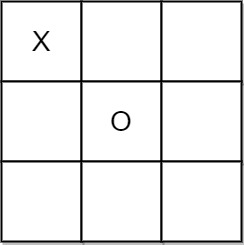

# [1275. Find Winner on a Tic Tac Toe Game](https://leetcode.com/problems/find-winner-on-a-tic-tac-toe-game/)

## Problem

Tic-tac-toe is played by two players A and B on a 3 x 3 grid. The rules of
Tic-Tac-Toe are:

* Players take turns placing characters into empty squares ' '.
* The first player A always places 'X' characters, while the second player B
  always places 'O' characters.
* 'X' and 'O' characters are always placed into empty squares, never on filled
  ones.
* The game ends when there are three of the same (non-empty) character filling
  any row, column, or diagonal.
* The game also ends if all squares are non-empty.
* No more moves can be played if the game is over.

Given a 2D integer array moves where `moves[i] = [rowi, coli]` indicates that
the `i`th move will be played on `grid[rowi][coli]`. return the winner of the
game if it exists (A or B). In case the game ends in a draw return "Draw". If
there are still movements to play return "Pending".

You can assume that moves is valid (i.e., it follows the rules of Tic-Tac-Toe),
the grid is initially empty, and A will play first.

#### Constraints

* `1 <= moves.length <= 9`
* `moves[i].length == 2`
* `0 <= rowi, coli <= 2`
* There are no repeated elements on moves.
* `moves` follow the rules of tic tac toe.

#### Examples


```text
Input: moves = [[0,0],[2,0],[1,1],[2,1],[2,2]]
Output: "A"
Explanation: A wins, they always play first.
```


```text
Input: moves = [[0,0],[1,1],[0,1],[0,2],[1,0],[2,0]]
Output: "B"
Explanation: B wins.
```


```text
Input: moves = [[0,0],[1,1],[2,0],[1,0],[1,2],[2,1],[0,1],[0,2],[2,2]]
Output: "Draw"
Explanation: The game ends in a draw since there are no moves to make.
```



```text
Input: moves = [[0,0],[1,1]]
Output: "Pending"
Explanation: The game has not finished yet.
```

## Solution

```rust
pub fn tictactoe(moves: Vec<Vec<i32>>) -> String {
    let mut board = vec![0u8; 9];

    for m in moves.iter().step_by(2) {
        let idx = (m[0] * 3 + m[1]) as usize;
        board[idx] = 1;
    }

    for m in moves.iter().skip(1).step_by(2) {
        let idx = (m[0] * 3 + m[1]) as usize;
        board[idx] = 2;
    }

    let mut result = 0;
    for r in 0..3 {
        result = board[r * 3 + 0] * board[r * 3 + 1] * board[r * 3 + 2];
        if result == 1 || result == 8 {
            break;
        }
    }

    if result == 1 {
        return "A".to_owned();
    } else if result == 8 {
        return "B".to_owned();
    }

    result = 0;
    for c in 0..3 {
        result = board[0 + c] * board[3 + c] * board[6 + c];
        if result == 1 || result == 8 {
            break;
        }
    }

    if result == 1 {
        return "A".to_owned();
    } else if result == 8 {
        return "B".to_owned();
    }

    result = board[0] * board[4] * board[8];
    if result == 1 {
        return "A".to_owned();
    } else if result == 8 {
        return "B".to_owned();
    }

    result = board[2] * board[4] * board[6];
    if result == 1 {
        return "A".to_owned();
    } else if result == 8 {
        return "B".to_owned();
    }

    if moves.len() == 9 {
        return "Draw".to_owned();
    }
    return "Pending".to_owned();
}
```