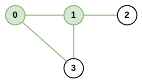

# [1615. Maximal Network Rank](https://leetcode.com/problems/maximal-network-rank/)

## Problem

### Description

There is an infrastructure of `n` cities with some number of roads connecting
these cities. Each `roads[i] = [ai, bi]` indicates that there is a bidirectional
road between cities `ai` and `bi`.

The network rank of two different cities is defined as the total number of
directly connected roads to either city. If a road is directly connected to both
cities, it is only counted once.

The maximal network rank of the infrastructure is the maximum network rank of
all pairs of different cities.

Given the integer `n` and the array `roads`, return the maximal network rank of
the entire infrastructure.

### Constraints

* `2 <= n <= 100`
* `0 <= roads.length <= n * (n - 1) / 2`
* `roads[i].length == 2`
* `0 <= ai, bi <= n-1`
* `ai != bi`
* Each pair of cities has at most one road connecting them.

### Examples

#### Example 1



```text
Input: n = 4, roads = [[0,1],[0,3],[1,2],[1,3]]
Output: 4
Explanation: The network rank of cities 0 and 1 is 4 as there are 4 roads that are connected to either 0 or 1. The road between 0 and 1 is only counted once.
```

#### Example 2


```text
Input: n = 5, roads = [[0,1],[0,3],[1,2],[1,3],[2,3],[2,4]]
Output: 5
Explanation: There are 5 roads that are connected to cities 1 or 2.
```

#### Example 3

```text
Input: n = 8, roads = [[0,1],[1,2],[2,3],[2,4],[5,6],[5,7]]
Output: 5
Explanation: The network rank of 2 and 5 is 5. Notice that all the cities do not have to be connected.
```

## SSolutions

```rust
use std::collections::HashSet;

pub fn maximal_network_rank(n: usize, roads: Vec<Vec<i32>>) -> i32 {
    let mut node_edges = vec![HashSet::new(); n];
    for edge in roads.into_iter() {
        node_edges[edge[0] as usize].insert(edge[1] as usize);
        node_edges[edge[1] as usize].insert(edge[0] as usize);
    }

    let mut answer = 0;
    for (city_1, roads_1) in node_edges.iter().enumerate() {
        for roads_2 in node_edges.iter().skip(city_1 + 1) {
            let mut rank = roads_1.len() + roads_2.len();

            // If the two cities are connected directly,
            // reduce the rank by one in order to count
            // the connecting road only once
            if roads_2.contains(&city_1) {
                rank -= 1;
            }

            answer = answer.max(rank);
        }
    }

    answer as i32
}
```

Or with an adjacency matrix:

```rust

pub fn maximal_network_rank(n: usize, roads: Vec<Vec<i32>>) -> i32 {
    let mut connected = vec![vec![false; n]; n];
    let mut edge_count = vec![0; n];
    for edge in roads.into_iter() {
        let a = edge[0] as usize;
        let b = edge[1] as usize;
        edge_count[a] += 1;
        edge_count[b] += 1;
        connected[a][b] = true;
        connected[b][a] = true;
    }

    let mut answer = 0;
    for a in 0..n {
        for b in a + 1..n {
            let mut rank = edge_count[a] + edge_count[b];
            if connected[a][b] {
                rank -= 1;
            }

            answer = answer.max(rank);
        }
    }

    answer as i32
}
```