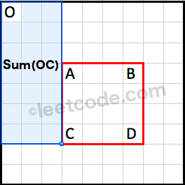

# [304. Range Sum Query 2D - Immutable](https://leetcode.com/problems/range-sum-query-2d-immutable/)

## Problem

### Description

Given a 2D matrix `matrix`, handle multiple queries of the following type:

* Calculate the sum of the elements of matrix inside the rectangle defined by
  its upper left corner (`row1`, `col1`) and lower right corner (`row2`, `col2`)

Implement the `NumMatrix` class:

* `NumMatrix(int[][] matrix)` Initializes the object with the integer
  matrix `matrix`.
* `int sumRegion(int row1, int col1, int row2, int col2)` Returns the sum of the
  elements of `matrix` inside the rectangle defined by its upper left
  corner (`row1`, `col1`) and lower right corner (`row2`, `col2`).

### Constraints

* m == matrix.length
* n == matrix[i].length
* `1 <= m, n <= 200`
* `-10^5 <= matrix[i][j] <= 10^5`
* `0 <= row1 <= row2 < m`
* `0 <= col1 <= col2 < n`
* `At most 104 calls will be made to sumRegion.`

### Examples

#### Example 1


```text
Input
["NumMatrix", "sumRegion", "sumRegion", "sumRegion"]
[[[[3, 0, 1, 4, 2], [5, 6, 3, 2, 1], [1, 2, 0, 1, 5], [4, 1, 0, 1, 7], [1, 0, 3, 0, 5]]], [2, 1, 4, 3], [1, 1, 2, 2], [1, 2, 2, 4]]
Output
[null, 8, 11, 12]

Explanation
NumMatrix numMatrix = new NumMatrix([[3, 0, 1, 4, 2], [5, 6, 3, 2, 1], [1, 2, 0, 1, 5], [4, 1, 0, 1, 7], [1, 0, 3, 0, 5]]);
numMatrix.sumRegion(2, 1, 4, 3); // return 8 (i.e sum of the red rectangle)
numMatrix.sumRegion(1, 1, 2, 2); // return 11 (i.e sum of the green rectangle)
numMatrix.sumRegion(1, 2, 2, 4); // return 12 (i.e sum of the blue rectangle)
```

## Solutions

### Using 1D prefix sums

* Calculate the prefix sum for each row independently
* Then sum the per-row prefix sums for each row of the matrix

```rust
struct NumMatrix {
    sums: Vec<Vec<i32>>,
}

impl NumMatrix {
    fn new(matrix: Vec<Vec<i32>>) -> Self {
        let mut sums = vec![vec![0; matrix[0].len()]; matrix.len()];
        for (r, row) in matrix.into_iter().enumerate() {
            let prefix_sum = &mut sums[r];

            prefix_sum[0] = row[0];
            for (c, col) in row.into_iter().enumerate().skip(1) {
                prefix_sum[c] = prefix_sum[c - 1] + col;
            }
        }

        Self { sums }
    }

    fn sum_region(&self, from_row: i32, from_col: i32, to_row: i32, to_col: i32) -> i32 {
        assert!(from_row <= to_row);
        assert!(from_row >= 0);
        assert!(from_col <= to_col);
        assert!(from_col >= 0);

        let mut total = 0;

        for row in from_row as usize..=to_row as usize {
            let prefix_sum = &self.sums[row];
            total += prefix_sum[to_col as usize];
            if from_col > 0 {
                total -= prefix_sum[from_col as usize - 1];
            }
        }

        total
    }
}
```

### Using a 2D prefix sum

We can extend the above idea to a 2D prefix sum:





```rust
struct NumMatrix {
    sums: Vec<Vec<i32>>,
}

impl NumMatrix {
    fn new(matrix: Vec<Vec<i32>>) -> Self {
        let mut sums = vec![vec![0; matrix[0].len()]; matrix.len()];
        for (r, row) in matrix.into_iter().enumerate() {
            for (c, cell) in row.into_iter().enumerate() {
                sums[r][c] = cell;

                if c > 0 {
                    sums[r][c] += sums[r][c - 1];
                }
                if r > 0 {
                    sums[r][c] += sums[r - 1][c];
                }

                // We've added the upper left diagonal cell twice! Once via the previous row,
                // and once via the previous colum. So we need to subtract it in order to get
                // the correct prefix sum
                if c > 0 && r > 0 {
                    sums[r][c] -= sums[r - 1][c - 1];
                }
            }
        }

        Self { sums }
    }

    fn sum_region(&self, from_row: i32, from_col: i32, to_row: i32, to_col: i32) -> i32 {
        assert!(from_row <= to_row);
        assert!(from_row >= 0);
        assert!(from_col <= to_col);
        assert!(from_col >= 0);

        let mut sum = self.sums[to_row as usize][to_col as usize];
        if from_row > 0 {
            sum -= self.sums[from_row as usize - 1][to_col as usize];
        }
        if from_col > 0 {
            sum -= self.sums[to_row as usize][from_col as usize - 1];
        }

        // We've subtracted the prefix sum corresponding to the rectangle
        // (0:0, from_row-1:from_col-1) twice, via the upper and left rectangles.
        // So in order to get the correct prefix sum, we have to add it.
        if from_row > 0 && from_col > 0 {
            sum += self.sums[from_row as usize - 1][from_col as usize - 1];
        }

        sum
    }
}
```

## Related Problems

* [303. Range Sum Query - Immutable](303%20-%20Range%20Sum%20Query%20-%20Immutable.md)