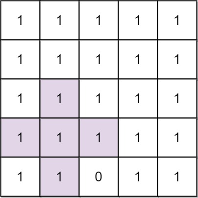

# [764. Largest Plus Sign](https://leetcode.com/problems/largest-plus-sign/)

## Problem

You are given an integer `n`. You have an `n x n` binary grid `grid` with all
values initially `1`'s except for some indices given in the array mines. The `i`
th element of the array mines is defined as `mines[i] = [xi, yi]`
where `grid[xi][yi] == 0`.

Return the order of the largest axis-aligned plus sign of `1`'s contained in
grid. If there is none, return `0`.

An axis-aligned plus sign of `1`'s of order `k` has some
center `grid[r][c] == 1` along with four arms of length `k - 1` going up, down,
left, and right, and made of 1's. Note that there could be `0`'s or `1`'s beyond
the arms of the plus sign, only the relevant area of the plus sign is checked
for `1`'s.

#### Constraints

* `1 <= n <= 500`
* `1 <= mines.length <= 5000`
* `0 <= xi, yi < n`
* All the pairs `(xi, yi)` are unique.

#### Examples



```text
Input: n = 5, mines = [[4,2]]
Output: 2
Explanation: In the above grid, the largest plus sign can only be of order 2. One of them is shown.
```


```text
Input: n = 1, mines = [[0,0]]
Output: 0
Explanation: There is no plus sign, so return 0.
```

## Solution

For each (cardinal) direction, and for each coordinate `(r, c)` let's compute
the count of that coordinate: the longest line of '`1`'s starting from `(r, c)`
and going in that direction. With dynamic programming, it is either `0`
if `grid[r][c]` is zero, else it is `1` plus the count of the coordinate in the
same direction. For example, if the direction is left and we have a row
like `01110110`, the corresponding count values are `01230120`, and the integers
are either `1` more than their successor, or `0`. For each square, we
want `dp[r][c]` to end up being the minimum of the 4 possible counts. At the
end, we take the maximum value in dp.

```rust
pub fn order_of_largest_plus_sign(n: i32, mines: Vec<Vec<i32>>) -> i32 {
    let mut grid = vec![i16::MAX; idx(n, n, 0)];
    for mine in mines {
        let pos = idx(n, mine[0], mine[1]);
        grid[pos] = 0;
    }

    for r in 0..n {
        let mut count = 0;
        for c in 0..n {
            let pos = idx(n, r, c);
            if grid[pos] == 0 {
                count = 0;
            } else {
                count += 1;
            }

            grid[pos] = count;
        }

        count = 0;
        for c in (0..n).rev() {
            let pos = idx(n, r, c);
            if grid[pos] == 0 {
                count = 0;
            } else {
                count += 1;
            }

            grid[pos] = grid[pos].min(count);
        }
    }

    let mut ans = 0;
    for c in 0..n {
        let mut count = 0;
        for r in 0..n {
            let pos = idx(n, r, c);
            if grid[pos] == 0 {
                count = 0;
            } else {
                count += 1;
            }

            grid[pos] = grid[pos].min(count);
        }

        count = 0;
        for r in (0..n).rev() {
            let pos = idx(n, r, c);
            if grid[pos] == 0 {
                count = 0;
            } else {
                count += 1;
            }

            grid[pos] = grid[pos].min(count);
            ans = ans.max(grid[pos]);
        }
    }

    ans as i32
}

fn idx(side: i32, row: i32, col: i32) -> usize {
    (row * side + col) as usize
}
```