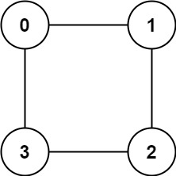

# [785. Is Graph Bipartite](https://leetcode.com/problems/is-graph-bipartite/)

## Problem

### Description

There is an undirected graph with `n` nodes, where each node is numbered
between `0` and `n - 1`. You are given a 2D array `graph`, where `graph[u]` is
an array of nodes that node `u` is adjacent to. More formally, for each `v`
in `graph[u]`, there is an undirected edge between node `u` and node `v`. The
graph has the following properties:

* There are no self-edges (`graph[u]` does not contain `u`).
* There are no parallel edges (`graph[u]` does not contain duplicate values).
* If `v` is in `graph[u]`, then `u` is in `graph[v]` (the graph is undirected).
* The graph may not be connected, meaning there may be two nodes `u` and `v`
  such that there is no path between them.

A graph is bipartite if the nodes can be partitioned into two independent
sets `A` and `B` such that every edge in the graph connects a node in set `A`
and a node in set `B`.

Return `true` if and only if it is bipartite.

### Constraints

* `graph.length == n`
* `1 <= n <= 100`
* `0 <= graph[u].length < n`
* `0 <= graph[u][i] <= n - 1`
* `graph[u]` does not contain `u`.
* All the values of `graph[u]` are unique.
* If `graph[u]` contains `v`, then `graph[v]` contains `u`.

### Examples

#### Example 1


```text
Input: graph = [[1,2,3],[0,2],[0,1,3],[0,2]]
Output: false
Explanation: There is no way to partition the nodes into two independent sets 
such that every edge connects a node in one and a node in the other.
```

#### Example 2



```text
Input: graph = [[1,3],[0,2],[1,3],[0,2]]
Output: true
Explanation: We can partition the nodes into two sets: {0, 2} and {1, 3}.
```

## Solutions

### DFS coloring of nodes (odd/even length cycle detection)

In order for the graph to be bipartite, a node's edges must all lead to nodes of
the opposite color. This can happen if and only if:

* there are no cycles in the graph
* all cycles must be of even length
    * note that the cycle length is measured by the number of nodes (vertices)
    * imagine the odd length `1 -> 2 -> 3 -> 1` graph (odd, because it has 3
      nodes), if we try to color it like `red -> blue -> red -> (blue)`, we see
      that the `1` must be both `red` and `blue` thus the graph is not bipartite

```rust
#[derive(Copy, Clone, Eq, PartialEq)]
enum Color {
    SetA,
    SetB,
}

impl Color {
    fn opposite(self) -> Color {
        match self {
            Color::SetA => Color::SetB,
            Color::SetB => Color::SetA,
        }
    }
}

pub fn is_bipartite(graph: Vec<Vec<i32>>) -> bool {
    let mut color = vec![None; graph.len()];
    for node in 0..graph.len() {
        // iterate over all nodes, because the graph may not be "connected"
        if !color_nodes_dfs(&graph, &mut color, node, None) {
            return false;
        }
    }
    true
}

fn color_nodes_dfs(
    graph: &[Vec<i32>],
    color: &mut [Option<Color>],
    node: usize,
    prev: Option<Color>,
) -> bool {
    if let Some(current) = color[node] {
        return match prev {
            // None, means that we have already processed this node 
            // in another iteration of the cycle in `is_bipartite`
            None => true,
            // If both colors are equal, we have detected a cycle of odd length,
            // otherwise we have detected a cycle of even length
            Some(prev) => current != prev,
        };
    }

    // We have not visited this node, so color it either using the opposite of 
    // the previous node's color if any, or use the default value
    let current = *color[node].insert(match prev { // note: insert returns a pointer to the inserted value!
        None => Color::SetA,
        Some(c) => c.opposite(),
    });

    // recursive coloring & cycle detection
    for next in graph[node].iter().map(|&x| x as usize) {
        if !color_nodes_dfs(graph, color, next, Some(current)) {
            // an odd length cycle was detected
            return false;
        }
    }

    true
}
```