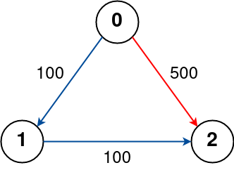

# [787. Cheapest Flights Within K Stops](https://leetcode.com/problems/cheapest-flights-within-k-stops/)

## Problem

### Description

There are `n` cities connected by some number of flights. You are given an array
flights where `flights[i] = [fromi, toi, pricei]` indicates that there is a
flight from city `from-i` to city `to-i` with cost `price-i`.

You are also given three integers `src`, `dst`, and `k`, return the cheapest
price from `src` to `dst` with at most `k` stops. If there is no such route,
return `-1`.

### Constraints

* `1 <= n <= 100`
* `0 <= flights.length <= (n * (n - 1) / 2)`
* `flights[i].length == 3`
* `0 <= fromi, toi < n`
* `fromi != toi`
* `1 <= pricei <= 104`
* There will not be any multiple flights between two cities.
* `0 <= src, dst, k < n`
* `src != dst`

### Examples

#### Example 1


```text
Input: n = 4, flights = [[0,1,100],[1,2,100],[2,0,100],[1,3,600],[2,3,200]], src = 0, dst = 3, k = 1
Output: 700
Explanation:
The graph is shown above.
The optimal path with at most 1 stop from city 0 to 3 is marked in red and has cost 100 + 600 = 700.
Note that the path through cities [0,1,2,3] is cheaper but is invalid because it uses 2 stops.
```

#### Example 2


```text
Input: n = 3, flights = [[0,1,100],[1,2,100],[0,2,500]], src = 0, dst = 2, k = 1
Output: 200
Explanation:
The graph is shown above.
The optimal path with at most 1 stop from city 0 to 2 is marked in red and has cost 100 + 100 = 200.
```

#### Example 3



```text
Input: n = 3, flights = [[0,1,100],[1,2,100],[0,2,500]], src = 0, dst = 2, k = 0
Output: 500
Explanation:
The graph is shown above.
The optimal path with no stops from city 0 to 2 is marked in red and has cost 500.
```

## Solutions

### BFS

```rust
pub fn find_cheapest_price(n: i32, flights: Vec<Vec<i32>>, src: i32, dst: i32, k: i32) -> i32 {
    assert_ne!(src, dst);

    let mut costs = vec![None; n as usize];
    let mut graph = vec![vec![]; n as usize];
    for flight in flights {
        graph[flight[0] as usize].push((flight[1] as usize, flight[2]));
    }

    let mut next = vec![];
    let mut queue = vec![(src as usize, 0)];

    let mut stops = 0;
    let mut cost = None;

    // - The starting node does not count as a "stop";
    // - The destination node does not count as a "stop"
    // So if we have START -> STOP -> DST, we have only one "stop" - the STOP node.
    // That's why we use `<=`, because the DST node can be on the "K+1" step
    while stops <= k && !queue.is_empty() {
        while let Some((node, price)) = queue.pop() {
            // Skip paths that are worse than the currently best path
            if let Some(cost) = cost {
                if price >= cost {
                    continue;
                }
            }

            // Skip nodes that we have already visited via some cheaper path
            if let Some(node_price) = costs[node] {
                if node_price <= price {
                    continue;
                }
            }

            costs[node] = Some(price);

            for (node, p) in graph[node].iter().copied() {
                // Skip paths that are worse than the currently best path
                if let Some(cost) = cost {
                    if cost < price + p {
                        continue;
                    }
                }

                if node == dst as usize {
                    if cost.is_none() || cost > Some(price + p) {
                        cost = Some(price + p);
                    }

                    continue;
                }

                // avoid pushing nodes in the queue when we know that they have a higher cost
                // than the currently best cost for that route
                if costs[node].is_none() || costs[node] > Some(price + p) {
                    next.push((node, price + p));
                }
            }
        }

        stops += 1;
        std::mem::swap(&mut queue, &mut next);
    }

    cost.unwrap_or(-1)
}
```

## Related Problems

* [743. Network Delay Time](743%20-%20Network%20Delay%20Time.md)
