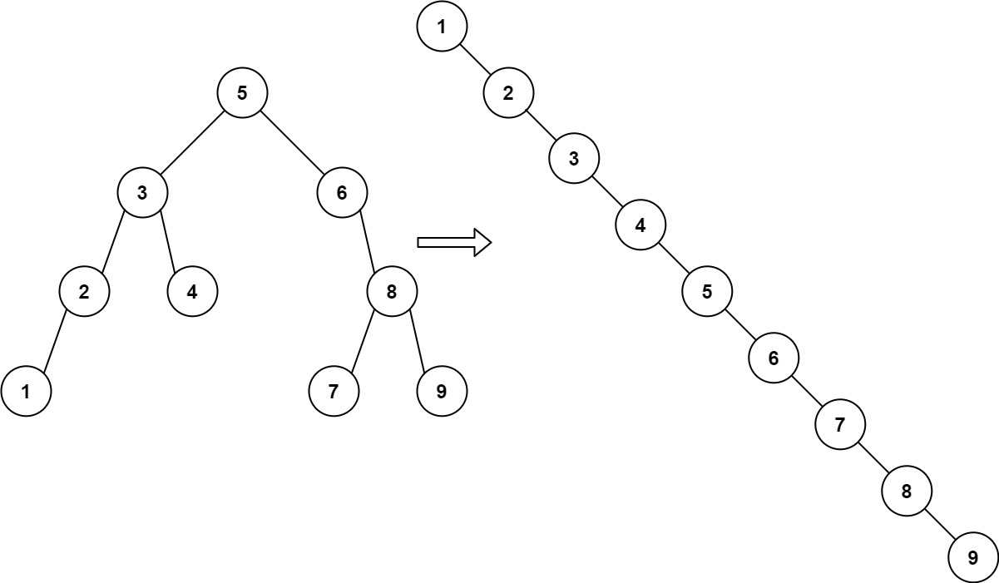

# [897. Increasing Order Search Tree](https://leetcode.com/problems/increasing-order-search-tree/)

## Problem

### Description

Given the `root` of a binary search tree, rearrange the tree in **in-order** so
that the leftmost node in the tree is now the `root` of the tree, and every node
has no left child and only one right child.

### Constraints

### Examples

#### Example 1



```text
Input: root = [5,3,6,2,4,null,8,1,null,null,null,7,9]
Output: [1,null,2,null,3,null,4,null,5,null,6,null,7,null,8,null,9]
```

#### Example 2


```text
Input: root = [5,1,7]
Output: [1,null,5,null,7]
```

## Solutions

We can get the increasing order by doing in-order traversal. One option is to
collect the properly ordered element in a vector and then build a new tree.
Another option is to modify the existing tree.

### In-order traversal with re-linking

```rust
use std::cell::RefCell;
use std::rc::Rc;

#[derive(Debug, PartialEq, Eq)]
pub struct TreeNode {
    pub val: i32,
    pub left: Option<Rc<RefCell<TreeNode>>>,
    pub right: Option<Rc<RefCell<TreeNode>>>,
}

impl TreeNode {
    #[inline]
    pub fn new(val: i32) -> Self {
        TreeNode {
            val,
            left: None,
            right: None,
        }
    }
}

pub fn increasing_bst(root: Option<Rc<RefCell<TreeNode>>>) -> Option<Rc<RefCell<TreeNode>>> {
    let mut stack = vec![];
    expand_left(root, &mut stack);

    let (head, mut tail) = match stack.pop() {
        // If there are no nodes then we just return None
        None => return None,

        // If there are elements - take the top of the stack (i.e. the smallest element)
        // and make it the root of the new tree
        Some(head) => {
            expand_left(head.borrow_mut().right.take(), &mut stack);
            (Some(head.clone()), head)
        }
    };

    // Iterate in in-order order over the remaining elements and
    // append them to the new tree
    while let Some(next) = stack.pop() {
        expand_left(next.borrow_mut().right.take(), &mut stack);

        tail.borrow_mut().right = Some(next.clone());
        tail = next;
    }

    head
}

fn expand_left(root: Option<Rc<RefCell<TreeNode>>>, dst: &mut Vec<Rc<RefCell<TreeNode>>>) {
    let mut buffer = root;

    while let Some(next) = buffer {
        buffer = next.borrow_mut().left.take();
        dst.push(next);
    }
}
```

## Related Problems

* [173. Binary Search Tree Iterator](/leetcode/100%20-%20199/173%20-%20Binary%20Search%20Tree%20Iterator.md)
